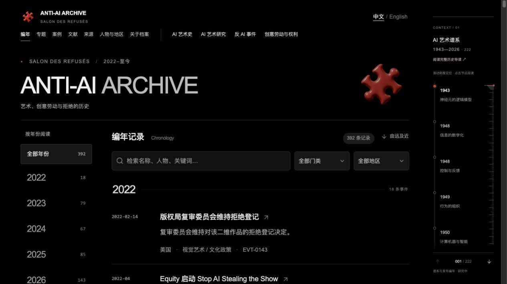
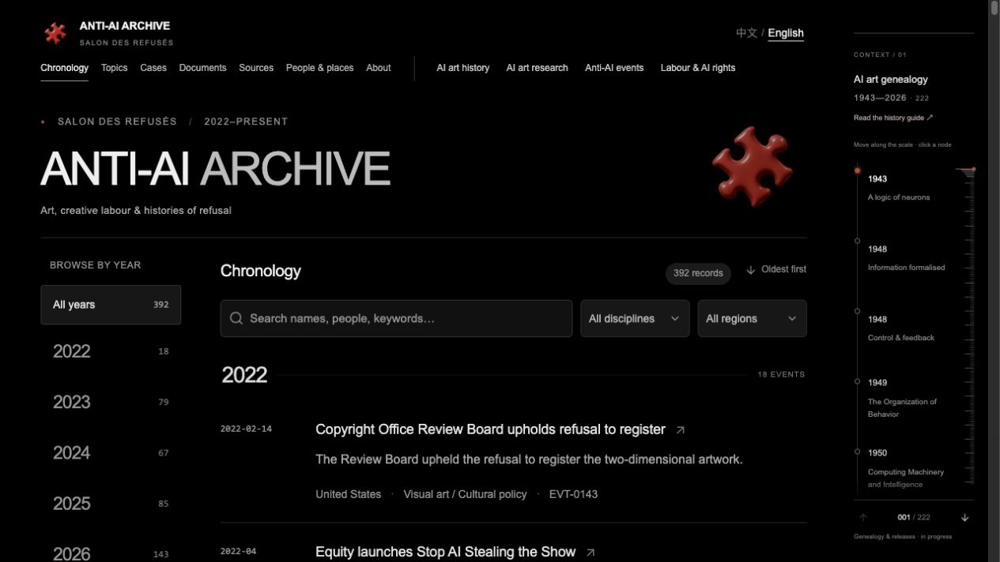

# ANTI-AI ARCHIVE · 2022–PRESENT

## SALON DES REFUSÉS
### Global movements, creative labour, cultural conflict, and the politics of generative AI

🧩 [中文网站](https://www.salondesrefuses.cn/)  
🧩 [English website](https://www.salondesrefuses.cn/en)  

ANTI-AI ARCHIVE is an ongoing research project documenting the global history of resistance, negotiation, conflict, and institutional change surrounding generative AI since 2022.

It does not treat “anti-AI” as a single ideology, nor as a simple opposition between humans and machines.

Instead, the archive traces how disputes over **artistic style, training data, authorship, labour, likeness, consent, copyright, platform governance, licensing, model access, and technical infrastructure** have developed across different regions and creative industries.

Its central question is:

> **Who is allowed to capture, train on, transform, reproduce, simulate, circulate, monetise, and govern cultural information — and under what conditions?**

The archive follows these conflicts across visual art, illustration, photography, music, literature, publishing, film, performance, games, cultural institutions, platforms, unions, courts, governments, rights holders, and AI companies.

---

# 中文介绍

**ANTI-AI ARCHIVE / SALON DES REFUSÉS** 是一个持续建设中的全球研究档案，记录自 2022 年以来围绕生成式人工智能产生的反对、拒绝、组织行动、协商、诉讼、平台治理、劳动冲突、商业谈判与制度变化。

本项目并不把“反 AI”理解为一个统一的政治立场，也不把这一历史简化为“人类与机器的对抗”。

档案真正关注的是：随着生成式 AI 进入文化生产，围绕 **风格、训练数据、作者身份、劳动、声音与肖像、同意、版权、平台规则、模型访问权、授权机制和技术基础设施** 的权利关系如何被重新组织。

项目持续追问：

> **谁有权抓取、训练、模仿、生成、复制、模拟、传播、授权和商业化文化信息？这些权力又是在什么条件下成立的？**

档案覆盖视觉艺术、插画、摄影、音乐、文学、出版、电影、表演、游戏、文化机构、平台、工会、法院、政府、权利方与 AI 公司，并通过编年记录、案例档案、文献目录与原始来源，追踪这些冲突如何随时间发生变化。

---

# From refusal to infrastructure

One recurring pattern in the archive is that resistance to generative AI has increasingly moved beyond symbolic protest.

Refusal does not simply disappear.

It becomes encoded.

Into **contracts**.  
Into **metadata**.  
Into **platform defaults**.  
Into **labour agreements**.  
Into **licensing systems**.  
Into **crawler rules**.  
Into **technical access controls**.  
Into **law**.

The archive therefore follows not only moments of protest, but the longer process through which cultural resistance can become governance.

A provisional historical trajectory visible across the materials is:

**Style → Data → Consent → Labour → Infrastructure → Control**

Alongside this runs another transformation:

**Symbolic refusal → Contractual refusal → Technical refusal → Infrastructural refusal**

These are not fixed historical stages, and they often overlap. They are working research patterns used to organise and test the archive as it grows.

---

# 从拒绝到基础设施

目前档案中已经反复出现一个重要变化：

对生成式 AI 的抵抗正在逐渐超出象征性的抗议。

**拒绝并没有消失，而是在被编码。**

它被写入：

- 合同
- 元数据
- 平台默认设置
- 劳动协议
- 授权制度
- 爬虫规则
- 技术访问控制
- 法律

因此，本项目不仅记录“谁反对 AI”，也追踪这些拒绝如何逐渐转化为制度、技术与经济结构。

目前从材料中可以观察到一条暂时性的研究路径：

**风格 → 数据 → 同意 → 劳动 → 基础设施 → 控制**

另一条并行路径是：

**象征性拒绝 → 合同性拒绝 → 技术性拒绝 → 基础设施性拒绝**

这些并不是严格的历史阶段，而是随着档案扩展持续接受检验和修正的研究模式。

---

# What the archive is tracking

The project currently follows several recurring areas of conflict:

### 1. Style and imitation
How are artistic styles identified, copied, learned, reproduced, or contested through generative systems?

### 2. Training data and scraping
What kinds of cultural material enter training pipelines, and under what technical, legal, or contractual conditions?

### 3. Consent and permission
Who has the authority to permit or refuse training, generation, imitation, reuse, or synthetic reproduction?

### 4. Creative labour
How do generative systems affect illustrators, writers, performers, musicians, voice actors, designers, photographers, and other cultural workers?

### 5. Voice, likeness, and digital replicas
How are identity, embodiment, voice, face, performance, and synthetic substitution negotiated?

### 6. Copyright and licensing
How do lawsuits, collective agreements, licences, settlements, and revenue-sharing systems reshape generative markets?

### 7. Platforms and infrastructure
How do platform rules, metadata, crawler blocking, content labels, recommendation systems, and default settings govern cultural information?

### 8. Model and corporate governance
How do AI companies, rights holders, cultural industries, governments, and institutions negotiate access, restrictions, safeguards, and market power?

---

# 项目重点

目前档案持续关注以下问题：

### 1. 风格与模仿
艺术风格如何被识别、学习、复制、生成和争议？

### 2. 训练数据与抓取
文化材料如何进入训练流程？其技术、法律与合同条件是什么？

### 3. 同意与许可
谁有权允许或拒绝训练、生成、模仿、再利用和合成复制？

### 4. 创意劳动
生成式系统如何改变插画师、作家、演员、音乐人、配音演员、设计师、摄影师及其他文化工作者的劳动关系？

### 5. 声音、肖像与数字替身
身份、身体、声音、脸部、表演和 synthetic replacement 如何进入新的权利谈判？

### 6. 版权与授权
诉讼、集体协议、商业授权、和解和收益分配如何重新塑造生成式 AI 市场？

### 7. 平台与基础设施
平台规则、元数据、防爬机制、内容标签、推荐系统和默认设置如何治理文化信息？

### 8. 模型与企业治理
AI 公司、权利方、文化产业、政府和机构如何重新谈判模型访问、限制条件、技术保障与市场权力？

---

# From “Is it AI?” to “Under what conditions?”

Many early disputes were framed through a simple binary:

**Human / AI**

As the archive develops, another set of distinctions becomes increasingly important:

**Authorised / Unauthorised**  
**Disclosed / Undisclosed**  
**Compensated / Uncompensated**  
**Traceable / Opaque**  
**Negotiated / Imposed**  
**Opt-in / Opt-out**

The historical question is therefore shifting from:

> **Is this AI?**

toward:

> **Under what conditions is this transformation considered legitimate?**

This shift is central to the archive.

---

# 从“是不是 AI”到“在什么条件下”

早期争议经常围绕一个二元问题展开：

**Human / AI**

但随着档案扩展，越来越重要的区分变成：

**授权 / 未授权**  
**披露 / 未披露**  
**有报酬 / 无报酬**  
**可追踪 / 不透明**  
**协商形成 / 单方面施加**  
**主动许可 / 默认使用后再退出**

因此，历史问题正在从：

> **“这是不是 AI？”**

逐渐转向：

> **“这种转换在什么条件下才具有合法性？”**

这是本项目持续追踪的核心变化之一。

---

# Archive structure

The website is organised as a research archive rather than a news feed.

It includes:

- **Chronology** — events and developments since 2022
- **Cases** — long-running disputes and evolving case histories
- **Documents** — statements, policies, legal documents, agreements, reports and related materials
- **Sources** — original links and source records
- **People & places** — actors, organisations, institutions and locations
- **Methodology** — notes on evidence, translation, verification and research status

The archive is continuously revised as new evidence, corrections, and developments emerge.

---

# 档案结构

网站并不是新闻聚合页，而是一个持续修订的研究档案。

主要包括：

- **编年 / Chronology**：2022 年以来的重要事件与变化
- **案例 / Cases**：持续发展的争议与长期案例
- **文献 / Documents**：声明、平台政策、法律文件、协议、报道及相关材料
- **来源 / Sources**：原始链接与来源记录
- **人物与地点 / People & Places**：相关个人、机构、组织与地区
- **研究方法 / Methodology**：证据、翻译、核读与研究状态说明

档案将随着新证据、勘误和后续发展持续更新。

---

# Method

The archive prioritises:

### Primary sources where available
Artist statements, union documents, platform announcements, legal filings, corporate policies, public agreements, institutional notices and other first-hand materials are prioritised whenever possible.

### Chronology over retrospective simplification
The project preserves how positions, claims, policies and negotiations change over time rather than reducing a case to its final outcome.

### Multiple positions
The archive does not assume that artists, workers, unions, platforms, companies, governments or rights holders share a single position on AI.

### Claims are not mechanisms
A public statement, policy promise, opt-out label, crawler block or contractual provision is recorded as what it is. The archive distinguishes stated intention from demonstrated technical effect.

### Cross-language research
The website provides Chinese and English reading routes while preserving original-language titles, credits and source links whenever possible.

### Ongoing revision
This is a research edition in progress, not an exhaustive or final account of global history.

---

# 研究方法

本档案遵循以下基本原则：

### 优先原始来源
在条件允许时，优先收录艺术家声明、工会文件、平台公告、法律文件、企业政策、公开协议、机构通知及其他一手材料。

### 保留时间过程
项目不仅记录最终结果，也保留立场、政策、争议和协商如何随时间发生变化。

### 不假定统一立场
艺术家、文化工作者、工会、平台、公司、政府和权利方并不存在统一的“反 AI”立场。

### 区分声明与机制
平台承诺、NoAI 标签、opt-out 设置、防爬措施和合同条款都会被分别记录；公开声明并不自动等同于已经实现的技术效果。

### 跨语言研究
网站提供中文与英文阅读入口，同时尽可能保留原语言标题、署名和原始来源链接。

### 持续修订
本项目是一项进行中的研究，不声称穷尽全球相关历史，也不将当前版本视为最终结论。

---

# Selected entry points

Individual cases are not the centre of the project, but they can provide useful entry points into larger historical questions.

Examples include:

- **ArtStation / NoAI** — symbolic protest, platform policy, defaults and crawler control
- **mimic** — upload eligibility, consent and responsibility for style imitation
- **SAG-AFTRA** — digital replicas, consent, compensation and collective bargaining
- **Suno / Udio** — copyright conflict, licensing and emerging revenue-sharing models
- **Seedance and film-industry disputes** — model capability, copyright pressure, safeguards and negotiated control

These cases are part of a much larger archive and should be read as nodes within broader historical transformations.

---

# 案例只是入口

具体案例并不是本项目的中心，而是进入更大历史结构的入口。

例如：

- **ArtStation / NoAI**：从象征抗议到平台政策、默认设置与 crawler control
- **mimic**：风格学习中的上传资格、同意与平台责任
- **SAG-AFTRA**：数字替身、同意、报酬与集体谈判
- **Suno / Udio**：版权冲突、授权制度与收益分配市场
- **Seedance 与影视行业争议**：模型能力、版权压力、技术保障与协商控制

这些案例只是整个档案网络中的节点，而不是档案本身的主题边界。

---

# Research premise

The archive is not primarily about whether AI is good or bad.

It is about how the right to use cultural information is being renegotiated.

What began in many places as resistance to imitation or training is increasingly becoming a struggle over **permission, access, default settings, labour conditions, licensing, technical control and institutional power**.

The archive documents that transformation while it is still taking place.

---

# 研究命题

本项目首先关心的并不是：

> **AI 是好还是坏？**

而是：

> **文化信息的使用权正在如何被重新谈判？**

许多最初围绕模仿、训练和创作者拒绝产生的争议，正在逐渐转化为对 **许可、访问、默认设置、劳动条件、商业授权、技术控制与制度权力** 的争夺。

ANTI-AI ARCHIVE 希望在这一历史仍然发生的过程中，对它进行持续记录。

---

# Languages and research notes

The website offers Chinese and English reading routes while preserving original-language titles, credits and links where possible.

Source review and translation review are recorded separately.

Some translations may include AI assistance and may not yet have received independent human review.

“Source-checked” does not mean that every allegation contained in a source has been independently verified.

Document catalogue entries do not imply that third-party full texts are preserved or redistributed. Rights remain with their respective rights holders.

---

# 语言与研究说明

网站提供中文与英文阅读入口，并尽可能保留原语言标题、署名和原始链接。

来源核读与翻译审校分别记录。

部分译文可能包含 AI 辅助，且尚未经独立人工审校。

“来源已核读”并不意味着来源中的全部指控均已得到独立核实。

文献目录中的记录也不意味着本项目保存或重新分发第三方全文，其权利仍属于各自权利人。

---

# Public showcase repository

This repository is the public showcase for ANTI-AI ARCHIVE.

It contains selected project descriptions, visual materials, public updates and research notes.

The complete research dataset, internal drafts, development source, automation workflows and deployment credentials are not included here.

---

# 关于本仓库

本仓库是 ANTI-AI ARCHIVE 的公开展示页。

这里主要保存项目介绍、视觉材料、公开更新与部分研究札记。

完整研究数据、内部草稿、网站开发源码、自动化工作流及部署凭据不包含在本仓库中。

---

# Updates & participation

The archive is continuously maintained.

If you would like to suggest a public source, correction, missing case or factual update, please open an Issue and include:

- the relevant archive page or case
- the original source URL
- the specific information to add or correct
- publication date and language where available

Submissions are reviewed before inclusion.

⭐ If this archive is useful to your research, you are welcome to star this repository.

---

# 更新与参与

档案正在持续维护。

如果你希望补充公开来源、提交勘误、提供遗漏案例或更新事实信息，可以通过 Issue 提交，并尽量附上：

- 对应的档案页面或案例
- 原始来源链接
- 需要补充或修正的具体内容
- 发布时间与原语言信息

提交内容将在核读后决定是否纳入。

⭐ 如果这个档案对你的研究有帮助，欢迎 Star 收藏。

---

## Visit the archive

🧩 https://www.salondesrefuses.cn/  
🧩 https://www.salondesrefuses.cn/en

**ANTI-AI ARCHIVE · SALON DES REFUSÉS**  
**2022–PRESENT**

---

## Website previews / 网站截图

Live website screenshots captured on 23 September 2026. Click either image to open the corresponding language version. / 截图采自 2026 年 9 月 23 日的线上网站，点击图片进入对应语言版本。

### 中文网站

### English website

