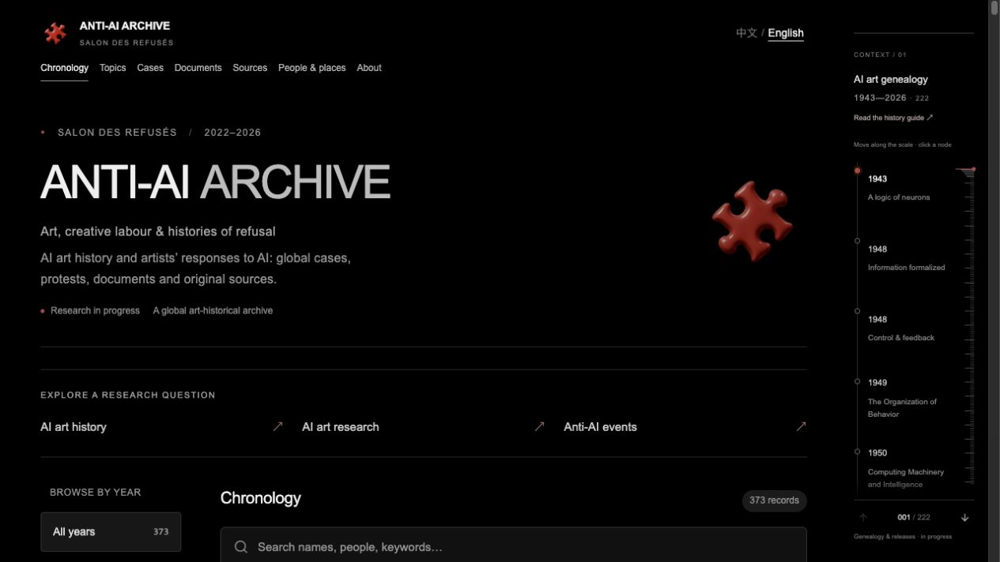

  

# ANTI-AI ARCHIVE · 2022–2026

**SALON DES REFUSÉS · 全球艺术史研究档案 / A global art-historical research archive**

[进入中文网站](https://salondesrefuses.cn/zh) · [Visit the English website](https://salondesrefuses.cn/en)

这是项目的公开展示页，提供研究入口、网站预览与双语更新。

This public showcase brings together research entry points, website previews and bilingual updates.

如果这个档案对你的研究有帮助，欢迎点击右上角 **Star** 收藏。

If the archive is useful to your research, **star this repository** to find it again.

[中文网站截图 / Chinese website preview](assets/website-zh.png) · [2026 年 9 月札记 / September 2026 notes](updates/2026-09.md)

## 从三个研究问题开始 / Three questions to explore

### 1. ArtStation / NoAI：拒绝如何成为平台规则？

How does refusal become a platform rule?

从 NoAI 标签、内容筛选与防爬公告入手，区分创作者表达、平台承诺和技术效果。标签本身不能证明作品未被抓取或已从模型中移除。

Follow announcements about NoAI tags, content filters and anti-scraping measures. Distinguish creators’ expressions, platform commitments and technical outcomes: a tag alone does not establish that a work was never scraped or removed from a model.

[中文案例](https://salondesrefuses.cn/zh/cases/case-0001) · [English case](https://salondesrefuses.cn/en/cases/case-0001)

### 2. mimic：谁能许可对创作风格的学习？

Who can authorise learning from a creative style?

日本 mimic 的停服及后续重启，为研究上传资格、同意和平台责任提供一个入口。案例保留日文来源信息，并区分企业公告与新闻报道。

Japan’s mimic suspension and subsequent relaunch offer an entry point into upload eligibility, consent and platform responsibility. The case preserves Japanese source information and distinguishes company announcements from reporting.

[中文案例](https://salondesrefuses.cn/zh/cases/case-0003) · [English case](https://salondesrefuses.cn/en/cases/case-0003)

### 3. SAG-AFTRA：数字替身如何进入劳动协商？

How do digital replicas enter labour negotiations?

从 2023 年影视罢工的开始、暂定协议与暂停罢工三个节点，追踪数字替身的同意与报酬问题；AI 并非罢工的唯一议题，暂定协议也不等于完成批准。

Trace consent and compensation for digital replicas through the beginning of the 2023 film and television strike, the tentative agreement and the suspension of the strike. AI was one of several bargaining issues; a tentative agreement is distinct from ratification.

[中文案例](https://salondesrefuses.cn/zh/cases/case-0024) · [English case](https://salondesrefuses.cn/en/cases/case-0024)

每个案例都提供中文、英文和原语言来源入口；这是研究路径，不代表档案已穷尽相关历史。

Each case provides Chinese and English reading routes and original-language source links. These are research paths, not claims of exhaustive historical coverage.

## 更新与参与 / Updates & participation

- [2026-09：首期公开展示札记 / First public showcase notes](updates/2026-09.md)
- [提交公开来源或勘误 / Suggest a public source or correction](https://github.com/HAOHAO1995/anti-ai-archive-showcase/issues/new/choose)

月度札记只总结已经公开发布的材料；没有实质变化时不凑数更新。提交线索时，请附案例链接、原始来源网址和需要修正的具体表述。

Monthly notes summarise already published material; unchanged months do not receive filler updates. For suggestions, include the case link, original source URL and the specific wording to correct.

## 中文介绍

ANTI-AI ARCHIVE 是一个持续研究中的全球艺术史档案，关注艺术家与文化工作者如何回应人工智能：拒绝、组织行动、协商和艺术实践，以及创作中的同意、劳动与控制权如何变化。

研究涉及视觉艺术、插画、摄影、音乐、文学、表演、电影、游戏及文化机构。档案以编年事件为入口，通过案例、文献编目和来源记录串联不同地区与立场。它是一项不断修订的研究，不声称穷尽全球相关历史。

### 在网站上可以浏览

- [编年与事件](https://salondesrefuses.cn/zh)：按时间阅读艺术实践与相关变化。
- [案例档案](https://salondesrefuses.cn/zh/cases)：追踪事件背景及后续发展。
- [文献目录](https://salondesrefuses.cn/zh/documents)：查看材料说明与关联记录。
- [来源索引](https://salondesrefuses.cn/zh/sources)：查找原始链接和来源信息。
- [研究方法与引用说明](https://salondesrefuses.cn/zh/about)：理解证据、翻译和研究状态。

### 语言与研究说明

网站提供中文和英文阅读入口，保留来源原语言的标题、署名及原始链接。来源核读与翻译审校分别记录；部分译文包含 AI 辅助，尚未经独立人工审校。

“来源已核读”不等于全部指控均已独立核实。文献编目也不代表保存了第三方全文，相关材料的权利仍属于各自权利人。

本展示仓库仅包含公开介绍、项目标识、网站截图及双语更新。网站开发源码、内部草稿、完整研究数据及部署凭据不在此仓库中。

## English introduction

ANTI-AI ARCHIVE is an ongoing global art-historical research project examining how artists and cultural workers respond to artificial intelligence through refusal, organising, negotiation and artistic practice, and how consent, labour and control change in creative work.

Its scope includes visual art, illustration, photography, music, literature, performance, film, games and cultural institutions. A chronology connects cases, document catalogues and sources across different places and positions. This is an evolving research edition, not an exhaustive account of global history.

### Explore the website

- [Chronology and events](https://salondesrefuses.cn/en): follow artistic practices and related developments over time.
- [Case archive](https://salondesrefuses.cn/en/cases): trace context and subsequent developments.
- [Document catalogue](https://salondesrefuses.cn/en/documents): read descriptions and explore related records.
- [Source index](https://salondesrefuses.cn/en/sources): locate original links and source information.
- [Methodology and citation](https://salondesrefuses.cn/en/about): understand evidence, translation and research status.

### Languages and research notes

The website offers Chinese and English reading routes while preserving original-language titles, credits and source links. Source verification and translation review are recorded separately. Some translations include AI assistance and have not been independently human-reviewed.

“Source-checked” does not mean that every allegation has been independently verified. A catalogue entry does not imply preservation of a third-party full text. Rights in those materials remain with their respective rights holders.

This showcase repository contains only the public introduction, project mark, website screenshots and bilingual updates. Website development source, internal drafts, the complete research dataset and deployment credentials are not included.

---

[访问网站 / Visit the archive](https://salondesrefuses.cn)
