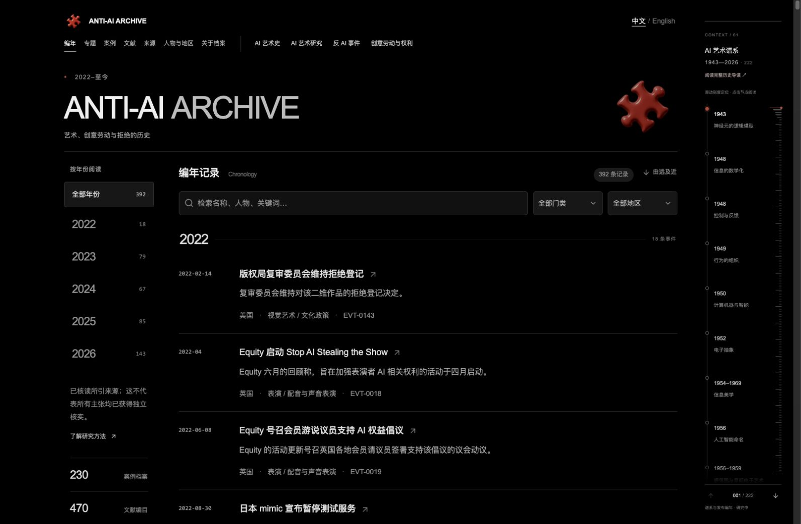
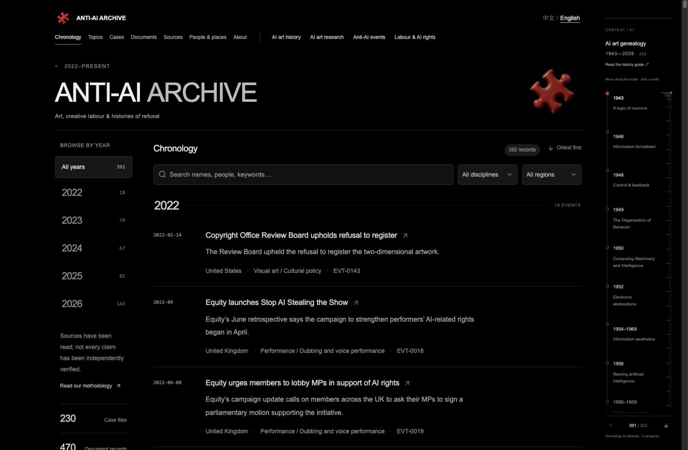

# ANTI-AI ARCHIVE · 2022–PRESENT

**一个持续记录自 2022 年以来生成式 AI 抵抗、协商与治理的全球研究档案。**

A global research archive tracing resistance, negotiation and governance around generative AI since 2022.

LUOCAO / CHEN HAOHAO

| Catalogue / 编目 | Total / 总数 |
| --- | ---: |
| Cases / 案例 | **240** |
| Events / 事件 | **414** |
| Documents & Essays / 文献与文章 | **522** |
| Sources / 来源 | **583** |
| People & Organisations / 人物与机构 | **358** |
| Generative Art History nodes / 生成艺术史节点 | **323** |
| Bilingual historical accounts / 双语节点正文 | **323** |
| Illustrated historical nodes / 已配图艺术史节点 | **302 / 323** |
| Illustrated documents & essays / 已配图文献与文章 | **342 / 522** |
| Languages / 语言 | Chinese / English / 中英双语 |

## Explore / 探索

- [中文网站](https://salondesrefuses.cn/zh)
- [English Website](https://salondesrefuses.cn/en)
- [Index: Cases, People & Places, Sources / 综合检索](https://salondesrefuses.cn/en/index) · [中文](https://salondesrefuses.cn/zh/index)
- [Research Method / 研究方法](docs/methodology.md)
- [Selected Cases / 重点案例](docs/selected-entry-points.md)
- [Research Updates / 研究更新](updates/README.md)
- [Cite This Project / 引用本项目](docs/citation.md)
- [Contribute a Source / Correction / 提交来源或纠错](CONTRIBUTING.md)

[3 October: Generative Art History expansion and linked timeline / 10 月 3 日：生成艺术史扩充与时间线联动](updates/2026-10.md)

[Generative Art History](https://salondesrefuses.cn/en/topics/ai-art-history) · [生成艺术史](https://salondesrefuses.cn/zh/topics/ai-art-history)

[Eight illustrated AI art research references](https://salondesrefuses.cn/en/topics/ai-art?kind=reference) · [八个配图研究参考专题](https://salondesrefuses.cn/zh/topics/ai-art?kind=reference)

## Current Status / 当前状态

| Field / 项目 | Status / 状态 |
| --- | --- |
| Status / 状态 | Active research archive / 持续更新中的研究档案 |
| Coverage / 覆盖时间 | 2022–present / 2022–至今 |
| Languages / 语言 | Chinese / English / 中英双语 |
| Last archive statistics sync / 最近统计同步 | 3 October 2026 / 2026 年 10 月 3 日 |
| Research edition / 研究版本 | 23 September baseline + 1–3 October additions / 9 月 23 日基线＋10 月 1—3 日增补 |

The figures describe the deployed edition recorded by that sync, not additions on that date or independent verification of every claim. Documents & Essays includes **520 catalogue records + 2 authored essays**. People & Organisations counts **358 event-linked index entries**, from **360 stored records**. Chinese and English versions are counted once; unpublished research is excluded. [Historical figures and counting notes](updates/2026-09.md).

以上为该次同步记录的已部署版本规模，不是当天新增量，也不代表全部主张已经独立核实。文献与文章包含 **520 条编目＋2 篇作者文章**；人物与机构为 **360 条记录中关联事件的 358 项索引**。中英文不重复计数，未发布研究不计入。[历史数字与计数说明](updates/2026-09.md)。

## Research Question / 核心研究问题

> Who is allowed to capture, train on, transform, reproduce, simulate, circulate, monetise, and govern cultural information — and under what conditions?
>
> 谁能够获取、训练、转换、复制、模拟、传播、商业化并治理文化信息——又是在什么条件下？

ANTI-AI ARCHIVE does not treat “anti-AI” as a single ideology or reduce these disputes to humans versus machines. It studies how generative AI reorganises power around style, training data, authorship, labour, likeness and voice, consent, copyright, licensing, platform governance and technical infrastructure.

ANTI-AI ARCHIVE 不把“反 AI”视为统一意识形态，也不把相关争议简化为“人类与机器”的冲突。它关注生成式 AI 进入文化生产后，围绕风格、训练数据、作者身份、劳动、肖像与声音、同意、版权、许可、平台治理与技术基础设施的权力关系如何被重新组织。

## What You Can Use Here / 你可以在这里使用什么

| Material / 材料 | Entry / 入口 |
| --- | --- |
| Research method and questions / 研究方法与问题 | [Methodology](docs/methodology.md) · [Research questions](docs/research-questions.md) |
| Research notes, updates and historical statistics / 研究札记、更新与历史统计 | [Update index / 更新索引](updates/README.md) |
| Selected cases and reading routes / 重点案例与阅读路径 | [Selected entry points / 重点入口](docs/selected-entry-points.md) |
| Citation metadata and guidance / 引用元数据与指南 | [CITATION.cff](CITATION.cff) · [Citation / 引用](docs/citation.md) |
| Contribution guidance / 贡献指南 | [CONTRIBUTING.md](CONTRIBUTING.md) |
| Public visuals and website screenshots / 公共视觉材料与网站截图 | [Assets / 视觉材料](assets/README.md) |

The complete internal research dataset is **not published in this showcase repository**. Selected structured public snapshots may be released as the archive develops, subject to the [data release policy](docs/data-release-policy.md). Public visibility does not itself grant a reuse license.

完整内部研究数据集**目前不在此展示仓库中公开**。随着档案发展，未来可能依照[数据发布政策](docs/data-release-policy.md)逐步发布经过筛选的结构化公开快照。公开可见不等于已经授予复用许可。

## Research Patterns Emerging from the Archive / 从档案中逐渐浮现的研究模式

**From refusal to infrastructure. / 从拒绝到基础设施。**

**Style → Data → Consent → Labour → Infrastructure → Control**

**风格 → 数据 → 同意 → 劳动 → 基础设施 → 控制**

**Symbolic refusal → Contractual refusal → Technical refusal → Infrastructural refusal**

**象征性拒绝 → 合同性拒绝 → 技术性拒绝 → 基础设施性拒绝**

These are provisional research patterns emerging from the materials, not predetermined historical stages. They overlap and remain open to revision, verification or rejection as evidence grows.

这些是从材料中逐步浮现的暂定研究模式，并非预设的固定历史阶段。它们相互重叠，并将随新证据继续被修正、验证或推翻。

**Refusal becomes encoded. / 拒绝被编码进系统。**

- contracts / 合同
- metadata / 元数据
- platform defaults / 平台默认设置
- labour agreements / 劳动协议
- licensing systems / 许可制度
- crawler rules / 爬虫规则
- technical access controls / 技术访问控制
- law / 法律

## Research Scope / 研究范围

The archive follows visual art, illustration, photography, music, literature, publishing, film, performance, games, cultural institutions, platforms, unions, courts, governments, rights holders and AI companies. Eight recurring questions organise the research: style and imitation; training data and scraping; consent; creative labour; voice and digital replicas; copyright and licensing; platforms and infrastructure; model and corporate governance.

档案覆盖视觉艺术、插画、摄影、音乐、文学、出版、电影、表演、游戏，以及文化机构、平台、工会、法院、政府、权利方和 AI 公司。八组持续研究的问题是：风格与模仿、训练数据与抓取、同意与许可、创意劳动、声音与数字替身、版权与许可、平台与基础设施、模型与企业治理。

[Research questions in Chinese and English / 完整双语研究问题](docs/research-questions.md)

## Selected Research Entry Points / 重点研究入口

These are questions to investigate through dated evidence, not settled outcomes or the archive’s boundaries. / 以下是通过有日期的证据开展研究的入口，不是既定结论，也不是档案的主题边界。

| Case / Topic · 案例 / 主题 | Research Question / 研究问题 | Main Themes / 主要主题 |
| --- | --- | --- |
| ArtStation / NoAI [中文](https://salondesrefuses.cn/zh/cases/case-0001) · [EN](https://salondesrefuses.cn/en/cases/case-0001) | How does symbolic protest become platform policy or crawler control? 象征性抗议如何逐步转化为平台政策或爬虫控制？ | style, consent, defaults, infrastructure / 风格、同意、默认设置、基础设施 |
| mimic [中文](https://salondesrefuses.cn/zh/cases/case-0003) · [EN](https://salondesrefuses.cn/en/cases/case-0003) | How should upload eligibility and responsibility for style imitation be allocated? 围绕风格模仿，上传资格和责任应如何划分？ | consent, platform governance, style / 同意、平台治理、风格 |
| SAG-AFTRA [中文](https://salondesrefuses.cn/zh/cases/case-0024) · [EN](https://salondesrefuses.cn/en/cases/case-0024) | How do digital replicas enter collective bargaining and labour negotiations? 数字替身如何进入集体谈判与劳动协商？ | likeness, labour, compensation, consent / 肖像、劳动、补偿、同意 |
| Suno: [中文](https://salondesrefuses.cn/zh/cases/case-0027) · [EN](https://salondesrefuses.cn/en/cases/case-0027) Udio: [中文](https://salondesrefuses.cn/zh/cases/case-0028) · [EN](https://salondesrefuses.cn/en/cases/case-0028) | How are copyright disputes connected to licensing and proposed revenue-sharing models? 版权冲突如何与许可及拟议的收益分配模型发生联系？ | copyright, licensing, markets / 版权、许可、市场 |
| Seedance / film-industry disputes · 影视行业争议 [中文](https://salondesrefuses.cn/zh/cases/case-0019) · [EN](https://salondesrefuses.cn/en/cases/case-0019) | How do model capabilities, copyright pressure and negotiated safeguards interact? 模型能力、版权压力与协商性保障之间如何互动？ | copyright, model governance, institutional control / 版权、模型治理、制度控制 |

[Reading cautions and case links / 阅读提示与案例链接](docs/selected-entry-points.md)

## From “Is it AI?” to “Under what conditions?” / 从“是不是 AI”到“在什么条件下”

The archive examines a shift from **“Is this AI?”** toward **“Under what conditions is this transformation considered legitimate?”** Authorisation, disclosure, compensation, traceability, negotiation and opt-in / opt-out arrangements are distinct questions; none alone establishes legitimacy.

档案追踪的问题从**“这是不是 AI？”**转向**“在什么条件下，这种转换被认为是合法、正当或可接受的？”** 授权、披露、补偿、可追踪性、协商和加入／退出安排是不同问题，不能仅凭某一项判断正当性。

[Analytical distinctions / 分析对](docs/research-questions.md#analytical-distinction)

## Archive Structure / 档案结构

The website is a **research archive, not a news feed**: chronology connects dated developments; cases follow disputes over time; documents and sources organise evidence; people and places connect actors and locations; the art-history timeline provides a longer historical context; research essays and notes develop interpretations. Entries are revised as new evidence appears.

网站是**研究档案，而非新闻信息流**：编年记录有日期的发展，案例追踪长期争议，文献与来源组织证据，人物与地点连接主体和地区，艺术史时间线提供更长的历史背景，研究文章与笔记展开解释。档案条目会随新证据修订。

[Structure and reading routes / 结构与阅读入口](docs/archive-structure.md)

## Method / 研究方法

- **Primary sources where available.** Prioritise artist statements, union documents, platform announcements, legal filings, corporate policies, public agreements and institutional notices.
- **Chronology over retrospective simplification.** Preserve changes in positions, claims and negotiations; do not reduce a case to its final outcome.
- **Multiple positions.** Artists, workers, unions, platforms, companies, governments and rights holders do not share a single position on AI.
- **Claims are not mechanisms.** Record statements, opt-out labels, crawler blocks and contracts as distinct forms of evidence; declared intention does not establish demonstrated technical effect.
- **Ongoing, non-exhaustive research.** Revise accounts as evidence changes; gaps do not prove that an event did not occur.

中文：

- **有条件时优先一手来源。** 包括艺术家声明、工会文件、平台公告、法律文件、企业政策、公开协议和机构通知。
- **保留时间过程，避免事后简化。** 保留立场、主张和协商的变化，不把案例压缩为最终结果。
- **保留不同立场。** 不假定艺术家、劳动者、工会、平台、企业、政府和权利方拥有统一立场。
- **声明、主张与实际机制不是一回事。** 分别记录声明、退出标签、爬虫限制和合同；公开承诺不自动证明技术效果。
- **持续修订且不求穷尽。** 随新证据更新叙述；未收录不代表未发生。

[Detailed methodology / 详细研究方法](docs/methodology.md)

## Languages and Research Notes / 语言与研究说明

The website provides Chinese and English reading routes while retaining original-language titles, credits and URLs. Source review and translation review are recorded separately. **“Source-checked” does not mean every allegation has been independently verified.** Some translations may be AI-assisted and may not have received independent human review. Catalogue entries do not imply preservation or redistribution of third-party full texts; rights remain with their respective holders.

网站提供中英文阅读入口，并保留原语言标题、署名和网址。来源核读与翻译审校分别记录。**“来源已核读”不等于每项指控都已独立核实。** 部分译文可能含 AI 辅助，且尚未经独立人工审校。目录收录不表示保存或重新分发第三方全文；权利仍归各自权利人。

## Public Repository Scope / 公开仓库范围

This is ANTI-AI ARCHIVE’s **public research showcase and entry point**. It contains selected descriptions, methodological guidance, public notes, update records, citation metadata and visuals. It does not contain the complete internal dataset, private drafts, unpublished source notes, website development source, private automation workflows or deployment credentials.

这里是 ANTI-AI ARCHIVE 的**公共研究展示与入口**，保存选定介绍、方法说明、公开笔记、更新记录、引用元数据和视觉材料，不包含完整内部数据集、私有草稿、未公开来源笔记、网站开发源码、私有自动化工作流或部署凭据。

[Public data release policy / 公开数据发布政策](docs/data-release-policy.md) · [Release types and existing releases / 发布类型与已有版本](docs/releases.md) · [Repository settings record / 仓库设置记录](docs/github-settings.md)

## Cite This Project / 引用本项目

**Author / 作者：Chen Haohao · Research identity / 研究身份：LUOCAO**

Use the record title, stable identifier, original source and access date when citing a particular case or event. For repository material, specify a commit or an existing release where possible. / 引用具体案例或事件时，注明条目标题、稳定编号、原始来源和访问日期；引用仓库材料时，尽可能指定提交或已有版本。

[CITATION.cff](CITATION.cff) · [Citation examples / 引用示例](docs/citation.md)

## Updates & Participation / 更新与参与

[Research updates / 研究更新](updates/README.md) · [Contribution guide / 参与指南](CONTRIBUTING.md) · [Existing introductory tasks / 已有入门任务](docs/GOOD_FIRST_ISSUES.md)

Found a missing source or case, a factual error, a broken link, or a translation or metadata problem? [Choose an Issue form](https://github.com/HAOHAO1995/anti-ai-archive-showcase/issues/new/choose), include the archive page and original evidence, and describe the proposed change. Submissions are reviewed before inclusion. If this archive is useful to your research, you are welcome to star it for future reference.

发现缺失来源或案例、事实错误、失效链接、翻译或元数据问题？请[选择 Issue 表单](https://github.com/HAOHAO1995/anti-ai-archive-showcase/issues/new/choose)，提供档案页面、原始证据及建议修改。提交经核读后决定是否收录。如果这个档案对你的研究有帮助，欢迎 Star 收藏以便日后查找。

## Website Previews / 网站截图

These screenshots were captured on **25 September 2026**, before the dark-glass revision described in the previous README. They are historical views; click an image to open the current website. / 以下截图摄于 **2026 年 9 月 25 日**，早于上一版 README 所记录的暗黑玻璃改版，属于历史视图；点击图片可打开当前网站。

### 中文网站

### English website

